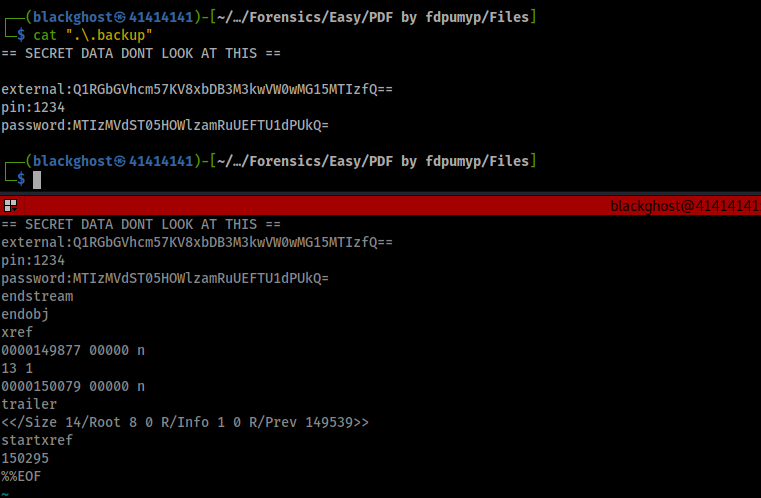

# PDF by fdpumyp [EASY]

CTFLEARN Challenge

link : https://ctflearn.com/challenge/957

We can use `strings dontopen.pdf | less` and get to the end of the document to get then encoded strings

or we can use the command `pdfdetach -saveall dontopen.pdf`

`pdfdetach` is a PDF forensic tool from `poppler-utils`
which can be installed in the system using `sudo apt install poppler-utils`

After decryption the base64 encoded text we can find the flag easily.